# 🚀 Autonomous Productivity Agent - Technical Presentation

**For:** Engineering Manager / Technical Lead  
**Duration:** ~20 Minutes  
**Goal:** Explain the system architecture, data flow, and value proposition.

---

## 1. 📊 System Architecture & Data Flow Diagram

This diagram visualizes the complete lifecycle of a user request, from the Telegram command to the final delivered result.

```mermaid
graph TD
    %% Nodes
    User(("👤 User (Telegram)"))
    TeleBot["🤖 Telegram Bot Service\n(Polling Interface)"]
    Server["🖥️ Node.js Express Server"]
    
    subgraph "🧠 AI Core Layer"
        Planner["📝 AI Planner Service\n(Google Gemini 2.5)"]
        Executor["⚙️ Step Executor Engine\n(State Machine)"]
        Enricher["✨ Content Enricher\n(Gemini - Summarization)"]
    end
    
    subgraph "🛠️ Tool Integration Layer"
        Search["🔍 Search Tool\n(Tavily API)"]
        Calendar["📅 Calendar Tool\n(MongoDB + ICS Gen)"]
        Email["📧 Email Tool\n(Nodemailer + PDF)"]
    end
    
    subgraph "💾 Data Persistence"
        DB[("🛢️ MongoDB\n(Plans, Users, Events)")]
        Redis[("⚡ Redis\n(Caching Plans)")]
    end

    %% Flows
    User -- "/plan Research AI & Schedule" --> TeleBot
    TeleBot -- "1. Send Goal" --> Planner
    Planner -- "2. Check Cache" --> Redis
    Planner -- "3. Generate Steps (JSON)" --> Server
    Server -- "4. Save Plan" --> DB
    
    Server -- "5. Execute Plan" --> Executor
    
    Executor -- "Step 1: Research" --> Search
    Search -- "Results" --> Executor
    
    Executor -- "Step 2: Schedule" --> Calendar
    Calendar -- "Save Event" --> DB
    Calendar -- "Generate .ics" --> Executor
    
    Executor -- "Step 3: Draft Email" --> Enricher
    Enricher -- "Summarized Context" --> Email
    Email -- "Send SMTP" --> User
    
    Executor -- "6. Real-time Log Updates" --> TeleBot
    TeleBot -- "✅ Updates: 'Researching...', 'Done'" --> User
```

---

## 2. 🗣️ Presentation Script (20 Minutes)

### **Phase 1: The "Why" & The Solution (0:00 - 3:00)**

**You:** "Hi [Manager Name], thanks for the time. I want to walk you through the **Autonomous Personal Productivity Agent** I've built.

**The Problem:** We waste hours context-switching. If I need to 'research a topic and schedule a breakdown meeting', currently I have to:
1. Open Google, search, read tabs.
2. Open my Calendar, find a slot.
3. Open Gmail, write a summary, attach files.
That’s three different apps and a lot of friction.

**The Solution:** An autonomous agent that lives in **Telegram**. I give it a high-level goal like *'Research Q1 marketing trends and schedule a kickoff meeting for Friday'*, and it handles the entire workflow autonomously: planning, researching, scheduling, and reporting."

---

### **Phase 2: High-Level Architecture (3:00 - 8:00)**

*(Show the Mermaid Diagram above)*

**You:** "Let's look at how it works under the hood. The system is built on **Node.js** with **TypeScript** for type safety, using a service-oriented architecture.

There are **three main components**:

1.  **The Planner (The Brain):**
    *   When a request comes in, we don't code IF/ELSE statements for every possibility.
    *   Instead, we send the goal to **Google Gemini**.
    *   The AI returns a **Structured JSON Execution Plan**. It decides *which* tools to use and in *what order*.
    *   *Technical Detail:* We use **Redis** here to cache frequent plans for speed.

2.  **The Executor (The Engine):**
    *   This is a state machine that reads the JSON plan.
    *   It iterates step-by-step. If Step 1 (Search) outputs data, that context is passed to Step 2.
    *   It handles error recovery—if a tool fails, it logs the error and decides whether to retry or abort.

3.  **The Tool Layer (The Hands):**
    *   **Search**: Connects to Tavily API for real-time web data.
    *   **Calendar**: Interacts with MongoDB to store events and generates standard `.ics` files so users can add them to Outlook/Google Calendar instantly.
    *   **Email**: Not just simple sending. It uses a **second AI pass** to synthesize the research and write a professional summary before sending."

---

### **Phase 3: The Execution Flow - "Life of a Request" (8:00 - 15:00)**

**You:** "Let's trace a request like: *'/plan Research React 19 features and email the team'*

1.  **Ingestion:** The Telegram connection receives the webhook. We identify the user via MongoDB.
2.  **Planning:** The `Planner Service` converts 'Research React 19' into:
    *   `Step 1: tool='search', query='React 19 new features'`
    *   `Step 2: tool='email', to='team@company.com'`
3.  **Execution - Step 1 (Search):**
    *   The executor calls the Search Tool.
    *   It fetches live web results.
    *   **Crucial Step:** We generate a **PDF Report** of these findings in the background using `PDFKit`.
4.  **Execution - Step 2 (Email):**
    *   The executor sees the email step.
    *   It detects that we have search results from Step 1.
    *   It triggers the **Context Enricher**: It feeds the raw search data to Gemini and asks it to write a professional executive summary.
    *   Finally, `Nodemailer` sends the email with the **PDF attached**.
5.  **Feedback loop:** Throughout this process, the server pushes real-time log updates ('🔍 Searching...', '✅ PDF Generated') back to the user on Telegram."

---

### **Phase 4: Technical Highlights & Future (15:00 - 20:00)**

**You:** "A few technical implementation details I'm proud of:

*   **Robustness:** We handle network timeouts (ECONNRESET) gracefully.
*   **Safety:** The prompts have strict rules prevents hallucinations, forcing valid JSON output.
*   **Extensibility:** Adding a new tool (like 'Jira' or 'Slack') is as simple as adding one function to the tool map; the AI automatically knows how to use it.

**Next Steps:**
I'm planning to add **Voice Input** so you can just talk to the bot while driving, and **Interactive Approval** so you can review the plan before it executes.

Happy to answer any questions about the stack or the implementation."

---

## 3. 📝 Cheat Sheet: Key Tech Stack

*   **Language:** TypeScript / Node.js
*   **AI Model:** Google Gemini 2.5 Flash (via `@google/genai`)
*   **Database:** MongoDB (Mongoose) + Redis (Cache)
*   **Search:** Tavily API
*   **Interface:** Telegram Bot API
*   **Utilities:** `pdfkit` (Reporting), `ics` (Calendar standard), `nodemailer` (SMTP)
